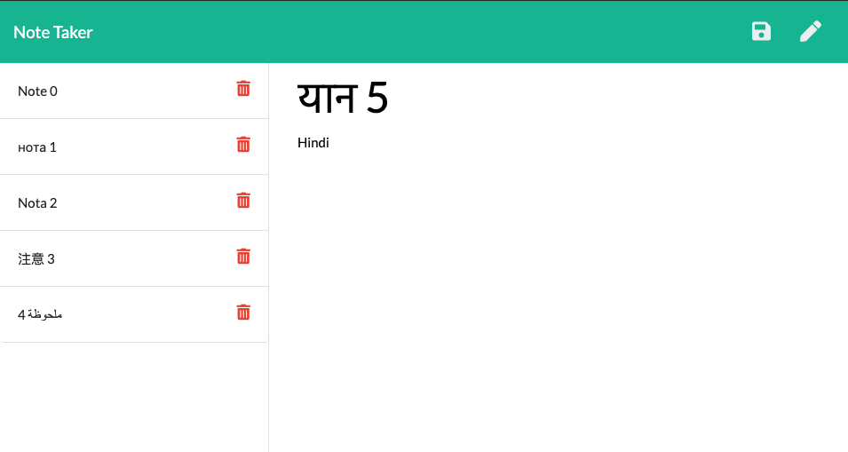

# 11 Express: Note Taker

    

## Description

Application made to help users that need to keep track of a lot of information in order to avoid forgetting something important. Being able to take persistent notes will allow users to have written information available when needed.

## GIF

Below is a quick demo walkingthorugh the main app functionality using a GIF.

## Table Of Contents

* [Description](#Description)
* [Gif](#Gif)
* [TableOfContents](#TableOfContents)
* [UserStory](#UserStory)
* [AcceptanceChecklist](#AcceptanceChecklist)
    * [InitialRequirements](#InitialRequirements)
    * [ApplicationRequirements](#ApplicationRequirements)
    * [SubmissionRequirements](#SubmissionRequirements)
* [AppDescription](#AppDescription)
    * [Dependencies](#Dependencies)
    * [DevDependencies](#DevDependecies)
    * [Installation](#Installation)
    * [Configuration](#Configuration)
    * [Operation](#Operation)
    * [Bonus](#Bonus)
* [Links](#Links)

## User Story

AS A user, I want to be able to write and save notes

I WANT to be able to delete notes I've written before

SO THAT I can organize my thoughts and keep track of tasks I need to complete

## Acceptance Checklist

### Initial Requirements

Create an application that can be used to write, save, and delete notes. This application will use an `express` backend and save and retrieve note data from a `JSON` file.

- Done. Issac.

The application frontend has already been created, it's your job to build the backend and connect the two.

- Front end was not modified in any way in order to implement backend. Done. Issac.

The following HTML routes should be created:

GET `/notes` - Should return the `notes.html` file.

GET `*` - Should return the `index.html` file

- HTML routes are being published from the following location: `./routes/public/pages.js`. Done. Issac

The application should have a `db.json` file on the backend that will be used to store and retrieve notes using the `fs` module.

- `JSON` file is being hosted in the following location `./db/db.json`. JSON content is being modifified by using `./helper/writer.js` module. `writer.js` promisifies `fileClear`, `fileAppend` and `fileRead` methods from `fs` and exposes them to be used by the API routes. Issac.

The following API routes should be created:

GET `/api/notes` - Should read the `db.json` file and return all saved notes as `JSON`.

- Done. Issac.

POST `/api/notes` - Should receive a new note to save on the request body, add it to the `db.json` file, and then return the new note to the client.

- Done. Issac.

DELETE `/api/notes/:id` - Should receive a query parameter containing the id of a note to delete. 
This means you'll need to find a way to give each note a unique `id` when it's saved. 
In order to delete a note, you'll need to read all notes from the `db.json` file, remove the note with the given `id` property, and then rewrite the notes to the `db.json` file.

- `UUID`npm library was used in order to generate an unique ID in the `POST` route. We slice the string and only use the last 5 digits for our unique ID. Issac.

### Application Requirements

Application should allow users to create and save notes.

- Done. Issac.

Application should allow users to view previously saved notes.

- Done. Issac.

Application should allow users to delete previously saved notes.

- Done. Issac.

### Submission Requirements

You will not be able to deploy your server side code on GitHub pages. This app should be deployed on Heroku.

- Heroku for the application being hosted in Heroku are provided in the [Links](#Links) section.

## Application Dependencies and Usage

### Dependencies

* `Express`. In order to create a webserver to publich our public pages and create the api routes.

* `FS`. This package allows us to clear, append and/or read to our files.

* `Moment`. We use this in otder to create a current timestamp.

* `Path`. Add on is used to resolve and manipulate system document path structures.

* `Util`. Required in order to promisify fs methods.

* `UUID`. Deployed this in order to generate an unique id (last 5 digits used only).

### Dev Dependencies

* `Nodemon`. In order to restart webserver automatically evertytime we do a code update.

### Usage 

*Step 1.* open link and landing page will appear. Click `Get Started` to begin:

*Step 2.* Existing notes should appear listed on the left side of the screen. Click on existing notes in order to displat content on the main section of the screen.

*Step 3.* Click where it says `Note Title` in order to submit a new note. 

*Step 4.* Afterwards click on where it says `Note Text` in order to submit the note's content.

*Step 5.* A `Floppy Disk` icon will appear in the far right corner, click it in order to save.

*Step 6.* Click on the trash icon in order to delete an existing note. 

### Bonus

* PUT `/api/notes/:id` was deployed in order to update an existing note. Method is not plugged in the front end since the provided files dont have this functionality implemented.

* `middleware/logger.js` is deployed in order to log in the terminal everytime an api or html route is being hit.

## Links

The following links provide video walkthroughs explaining the development decisions made for this project and a walkthrough of the usage of the app. Also provided is a slide deck for the explanation video

* [Heroku Link](https://mod11hwnotetaker.herokuapp.com/)

* [GitHub Repo](https://github.com/carlosissac/mod11hwnotetaker)